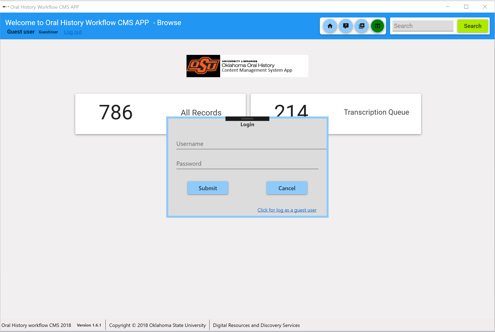
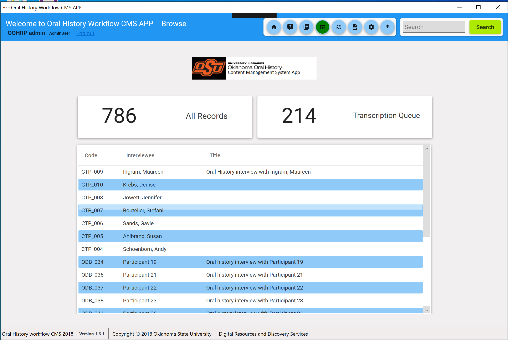
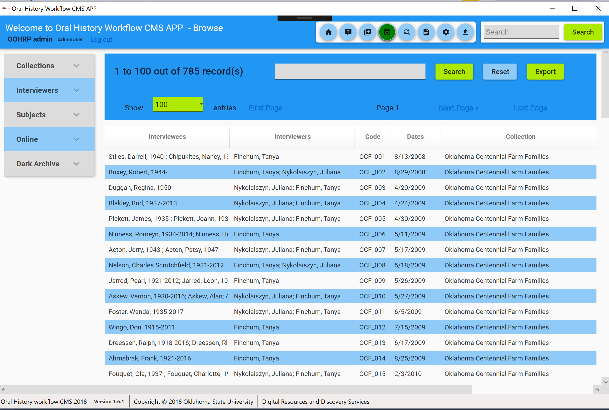
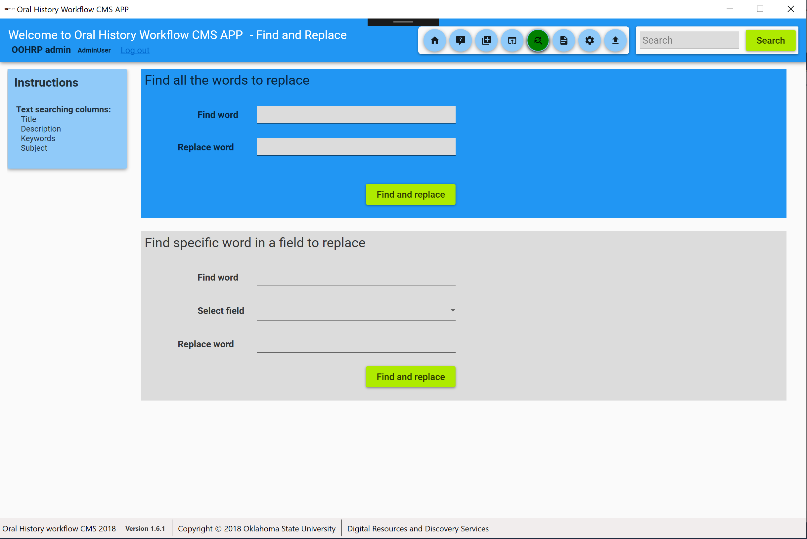

# OralHistoryWorkflowCMS

Visual Studio/ MySQL/ Desktop App

Oral history workflow content management system, a CMS is a piece of tool that helps you create and manage content related to oral History interview records. Systems enables to have multiple user types. System allows to add interview records (individual or bulk) , manage depending categories, modification (individual or bulk) and exporting. 

There are four types of roles Administrator, Staff, Student and Guest. 

## Things to run the application.

__Clone the repository__

```
git clone https://github.com/okstate-library/OralHistoryWorkflowCMS.git
```

__Go the folder__

```
db/mysql/query contains all the queries to create schemas and master data in MySQL DBMS.
```

The admin username and password are "admin" and “123”. After setup the system user can change his/her password.

__Set Your MySQL username & password in app.config__

Change the server, username and password on 
[app.config](../../blob/master/src/WpfApp/App.config)

__Run the application__

```
Open application from visual studio and run.
```

## Screen shots.

### login Page



### Home Page (Dashboard Page)



### Interview  Page


### Transcription queue Page   


### Interview Page   



### Find and replace Page   



### Report Page   


### Settings Page   


### Import records Page   


